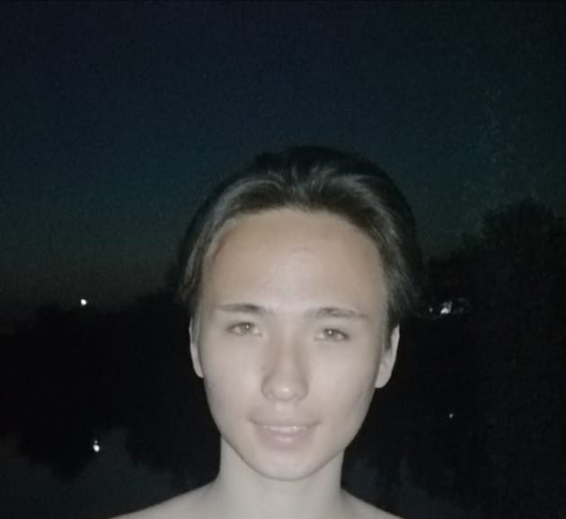

# Marsel Bisengaliev

 

## Who i am?

Hi dear reader, my name is Marsel Bisengaliev. I am 18 years old, from Kazakhstan.

I am loving programming, learning English language, drink tea, being in love and silence.

My dream is to be happy, have for real the best friends, have my own home and living in a democratic country.

 

## How I Started to Learn Programming?

For first I watched videos on YouTube these videos was about HTML,CSS,Boostrap.

I bought the courses in special web sites, on these videos I learned JS

I have been participating in a web development contest and for this contest I needed to know Laravel (it's PHP framework), so by using this framework I understood how working backend part 

 

## Skills do i have

<table style="width:100%">
  <tr>
    <td>Name</td>
    <td>JS</td>
    <td>HTML & CSS</td>
    <td>React JS</td>
    <td>Laravel</td>
    <td>Node JS</td>
  </tr>
  <tr>
    <td>%</td>
    <td>80</td>
    <td>95</td>
    <td>60</td>
    <td>50</td>
    <td>55</td>
  </tr>
</table>

 

## Social Media

<ul>
    <li><a href="https://t.me/marsel_bisengaliev">Telegram</a></li>
    <li><a href="https://www.instagram.com/marsel_bisengaliev/">Instagram</a></li>
    <li><a href="https://vk.com/marsel_bisengaliev">VK</a></li>
</ul>
